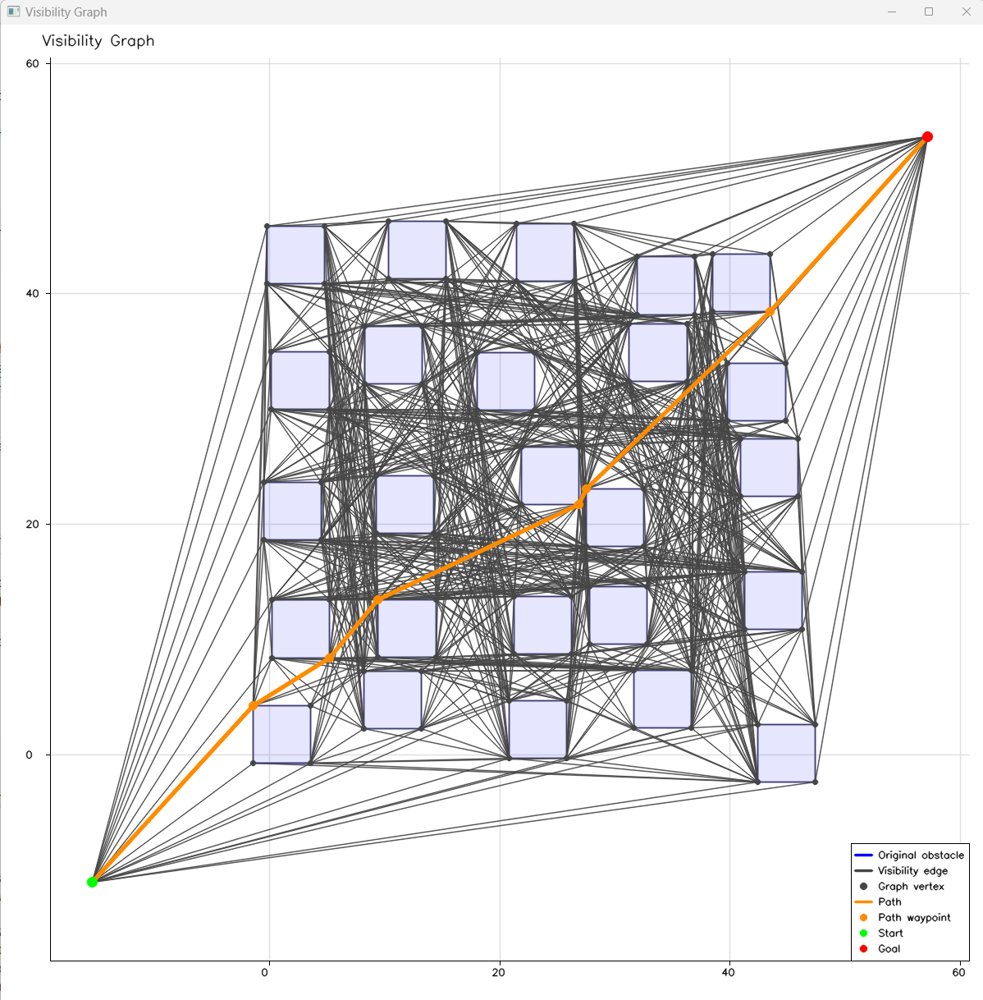

# VisGraphPlanner

A C++ visibility-graph planner for static 2-D polygonal environments.

VisGraphPlanner constructs and uses a visibility graph for path planning around polygonal obstacles. The core planner is a header-only CMake target. Optional visualization support and the demonstration executable use [MatPlotOpenCV](https://github.com/mwhannan74/MatPlotOpenCV).

## Platform Status

This project has been built and tested only on Windows. The code and CMake configuration are intended to be portable to Linux, but Linux has not yet been tested.

## Requirements

- CMake 3.16 or newer
- A C++17 compiler
- [Eigen](https://eigen.tuxfamily.org/) for the core planner
- [MatPlotOpenCV](https://github.com/mwhannan74/MatPlotOpenCV) for visualization and the demo
- OpenCV 4.5 or newer with the `core`, `highgui`, and `imgproc` components, as required by MatPlotOpenCV
- Doxygen if MatPlotOpenCV documentation is enabled; pass `-DMATPLOTOPENCV_BUILD_DOCS=OFF` if it is not needed

The visualization header includes `figure.h`. That file is provided by MatPlotOpenCV; it is not part of this repository. The core `visibility_graph.hpp` header does not depend on MatPlotOpenCV or OpenCV.

## Configure Dependencies

The default local paths are defined in [`cmake/local_paths.cmake`](cmake/local_paths.cmake):

- `VISGRAPH_EIGEN3_INCLUDE_DIR` points to the Eigen include directory.
- `VISGRAPH_MPOCV_SOURCE_DIR` points to the MatPlotOpenCV source directory containing its `CMakeLists.txt`.

The default MatPlotOpenCV path expects both repositories to have the same parent directory:

```text
parent-directory/
|-- MatPlotOpenCV/
`-- VisGraphPlanner/
```

Edit `cmake/local_paths.cmake` for your machine or override its cached values when configuring:

```bash
cmake -S . -B build -DVISGRAPH_EIGEN3_INCLUDE_DIR=/path/to/eigen -DVISGRAPH_MPOCV_SOURCE_DIR=/path/to/MatPlotOpenCV -DMATPLOTOPENCV_OPENCV_DIR=/path/to/opencv/cmake
```

`MATPLOTOPENCV_OPENCV_DIR` must identify the directory containing `OpenCVConfig.cmake`.

## Build

From the repository root:

```bash
cmake -S . -B build
cmake --build build --config Release
```

To use only the core planner without the visualization dependencies or demo:

```bash
cmake -S . -B build -DVISGRAPH_ENABLE_VISUALIZATION=OFF -DVISGRAPH_BUILD_DEMO=OFF
cmake --build build --config Release
```

MatPlotOpenCV enables its own demo and documentation targets by default. Add `-DMATPLOTOPENCV_BUILD_DEMO=OFF -DMATPLOTOPENCV_BUILD_DOCS=OFF` to the configure command if you do not want to build them.

## Targets

The project provides the following CMake targets:

- `VisGraphPlanner::visgraph` — header-only core visibility-graph planner
- `VisGraphPlanner::visgraph_visualization` — optional visualization support through MatPlotOpenCV
- `main_demo` — demonstration executable, built when `VISGRAPH_BUILD_DEMO=ON`

## Run the Demo

From the repository root on Windows with a multi-configuration generator such as Visual Studio:

```powershell
.\build\Release\main_demo.exe
```



With a single-configuration generator, the executable is normally `build/main_demo` (`build/main_demo.exe` on Windows). The exact location depends on the selected CMake generator and build configuration.

## Project Scope

VisGraphPlanner is intended for path planning in static, two-dimensional environments represented by polygonal obstacles.

## License

VisGraphPlanner is licensed under the Apache License 2.0.

See [`LICENSE`](LICENSE) for the full license text.

Copyright 2025-2026 Michael Hannan.
